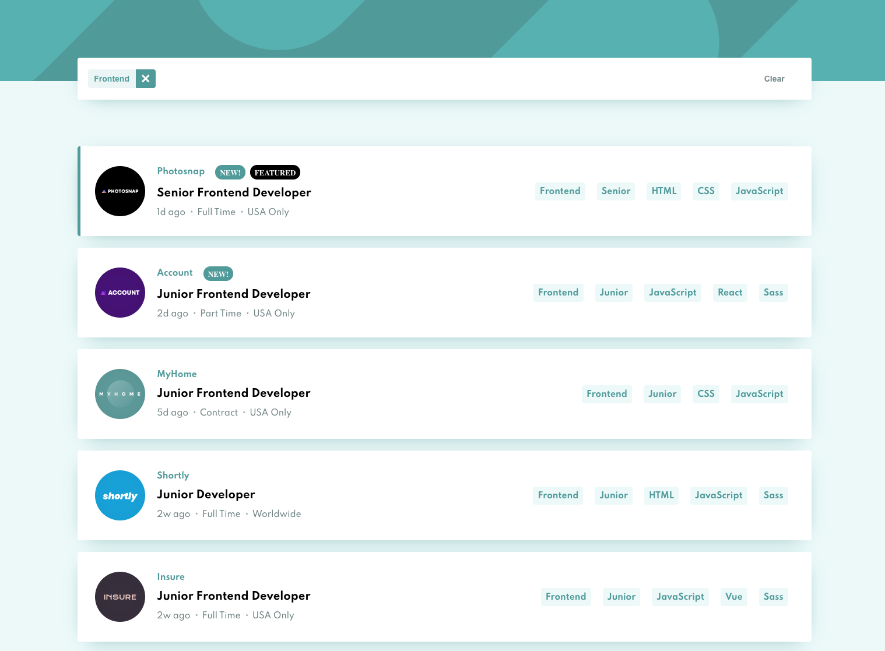
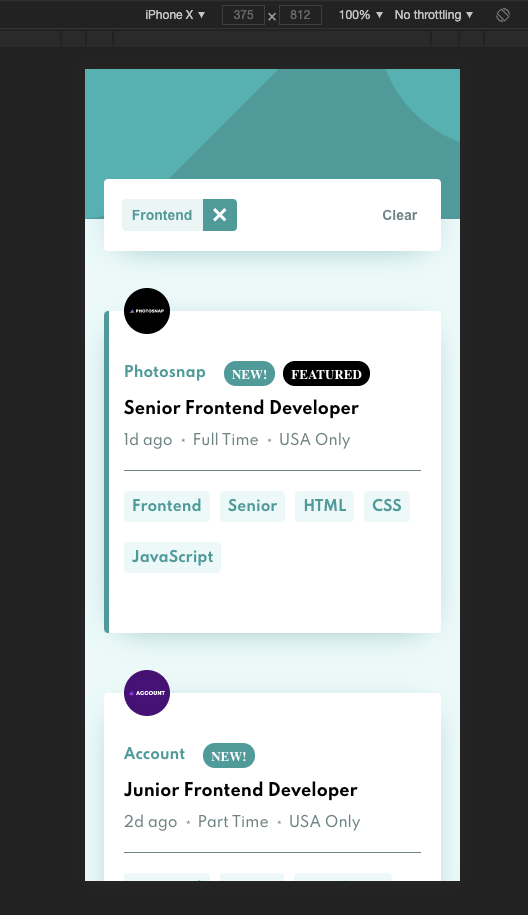

# Frontend Mentor - Job listings with filtering solution

This is a solution to the [Job listings with filtering challenge on Frontend Mentor](https://www.frontendmentor.io/challenges/job-listings-with-filtering-ivstIPCt). 

## Table of contents

- [Overview](#overview)
  - [The challenge](#the-challenge)
  - [Screenshots](#screenshots)
  - [Links](#links)
- [My process](#my-process)
  - [Built with](#built-with)
- [Author](#author)


## Overview

### The challenge

Users should be able to:

- View the optimal layout for the site depending on their device's screen size
- See hover states for all interactive elements on the page
- Filter job listings based on the categories

### Screenshots




### Links

- Solution URL: [https://github.com/jundymek/job-listings-vue](https://github.com/jundymek/job-listings-vue)
- Live Site URL: [https://jundymek.github.io/job-listings-vue/](https://jundymek.github.io/job-listings-vue/)

## My process

### Built with

- Semantic HTML5 markup
- SCSS
- Flexbox
- [Vue.js](https://v3.vuejs.org/) - JS library
- Typescript


### What I learned

Vue composition API - it is better than I thought. This little function does magic.

```js
const sortBy = ref<string[]>([]);
const allJobs = ref<JobType[]>(jobs);

export const useFilterJobs = (): {
  sortBy: Ref<string[]>;
  addSortElement: (item: string) => void;
  removeSortElement: (item: string) => void;
  removeAllSortElements: () => void;
  filteredJobs: ComputedRef<JobType[]>;
} => {
  const addSortElement = (item: string) => {
    if (sortBy.value.includes(item)) {
      return;
    } else {
      sortBy.value.push(item);
    }
  };

  const removeSortElement = (item: string) => {
    sortBy.value = sortBy.value.filter((element) => element !== item);
  };

  const removeAllSortElements = () => {
    sortBy.value = [];
  };

  const filteredJobs = computed(() => {
    return allJobs.value.filter((job) => {
      const filterOptions = job.languages.concat(
        ...job.tools,
        job.role,
        job.level
      );
      return sortBy.value.every((item) => filterOptions.includes(item));
    });
  });

  return {
    sortBy,
    addSortElement,
    removeSortElement,
    filteredJobs,
    removeAllSortElements,
  };
};
```

## Author

- Website - [https://jundymek.com](https://jundymek.com)
- Frontend Mentor - [@jundymek](https://www.frontendmentor.io/profile/jundymek)
- Github - [jundymek](https://github.com/jundymek)

